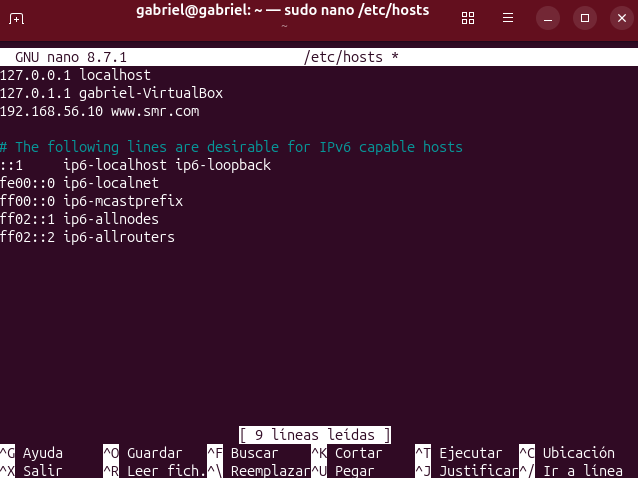

# Crear una pagina web con apache y que con una maquina virtual podamos entrar poniendo el url

ssh gabriel@ip del servidor | para conectarnos al servidor

sudo su | para tener siempre el poder de root

cd /var/www | para meternos en el directorio de las paginas web

mkdir smr y cd smr  | para crear un nuevo directorio y meternos en el

mkdir web y mkdir intranet | para crear los 2 directorios de las webs

cd web y nano index.html | para crear el archivo html deberemos de escribir una linea de html

cd ../intranet y nano intranet.html | para crear el archivo html de intranet haremos lo mismo que la otra

sudo apt install apache2-utils -y | para instalar apache2 utils

sudo htpasswd -c /etc/apache2/.htpasswd alumno | esto sirve para poner la contraseña, en el directorio /etc/apache2/.htpasswd con el user alumno

sudo nano /etc/apache2/ports.conf | Debajo de Listen 80 hay que poner 9999 sirve para que escuche por ese puerto en el navegador

sudo nano /etc/apache2/sites-available/smr.conf | Este sera el fichero de configuracion de la pagina

# Ponle este codigo a smr.conf
```apache
<VirtualHost *:80>
    ServerName www.smr.com
    DocumentRoot /var/www/smr/web
</VirtualHost>

<VirtualHost *:9999>
    ServerName www.smr.com
    DocumentRoot /var/www/smr/intranet
    DirectoryIndex intranet.html

    <Directory /var/www/smr/intranet>
        AuthType Basic
        AuthName "Intranet SMR"
        AuthUserFile /etc/apache2/.htpasswd
        Require valid-user
    </Directory>
</VirtualHost>
```
# Reiniciar Apache

sudo a2ensite smr.conf | Activa el fichero smr.conf

sudo a2dissite 000-default.conf | Desactiva el fichero predeterminado

sudo apachectl configtest | Esto comprueba si hay errores en alguna sintaxis en los archivos de apache

sudo systemctl restart apache2 | Reinicia el sistema de apache

# Comprobación

Ahora iniciamos una maquina virtual y nos aseguramos que este en la misma red, lo podemos hacer en conf de la MV en red poniendo NAT

## Ubuntu

sudo nano /etc/hosts | Nos metemos a la conf de los hosts locales

ip del servidor www.smr.com | Tenemos que poner esto en una linea mas

Deberia de quedar asi



Ahora si nos metemos al navegador por ejemplo firefox si escribimos http://www.smr.com deberia de funcionar y si ahora ponemos http://www.smr.com:9999 y nos meteriamos a la que pide contraseña.
