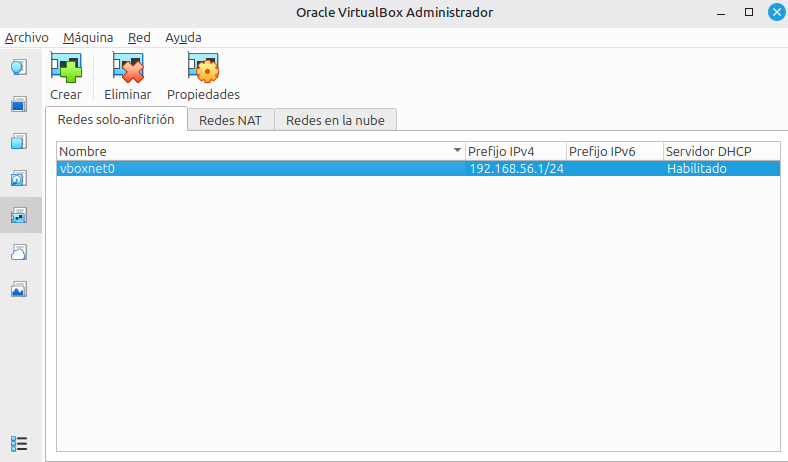
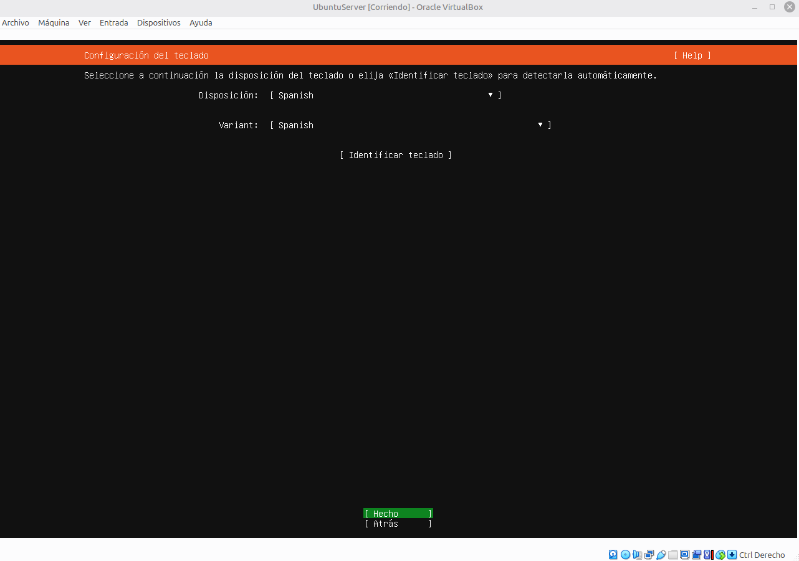
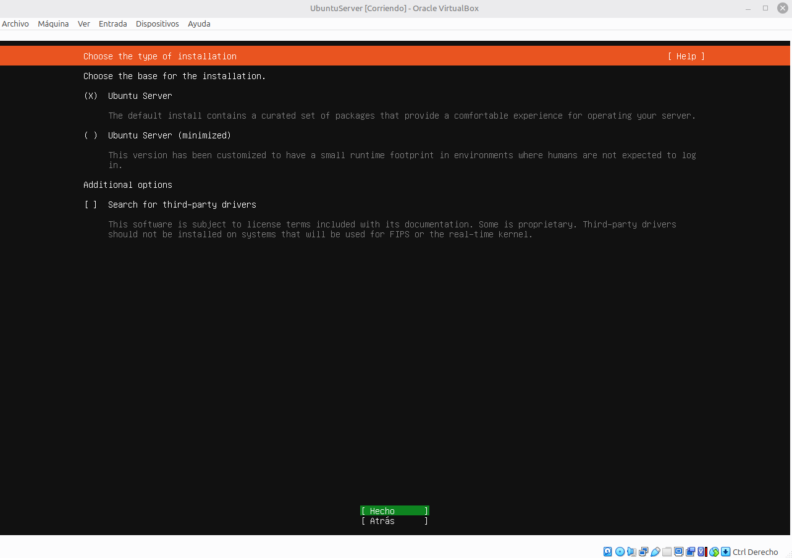
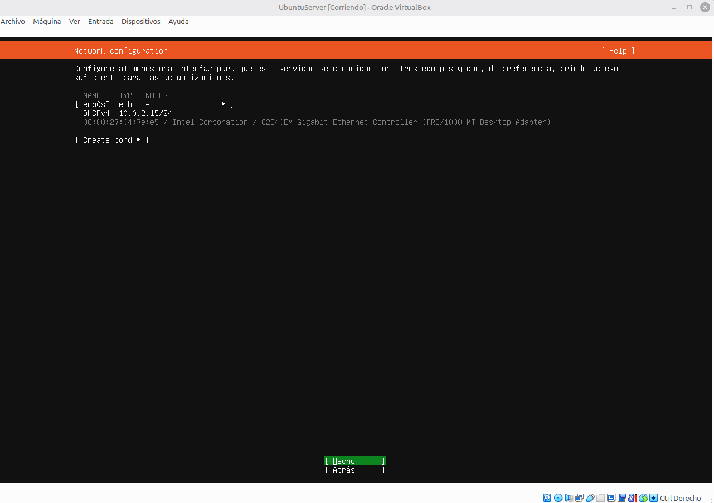
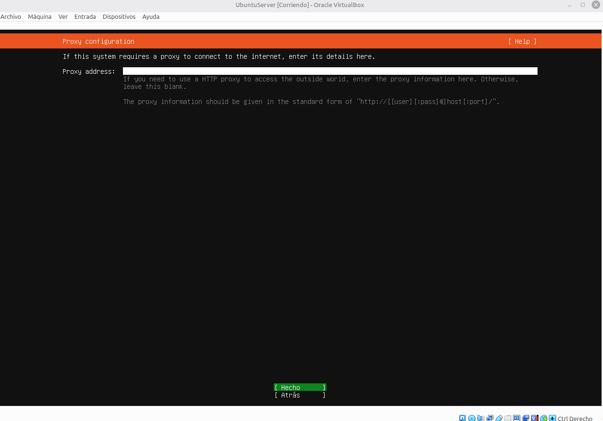
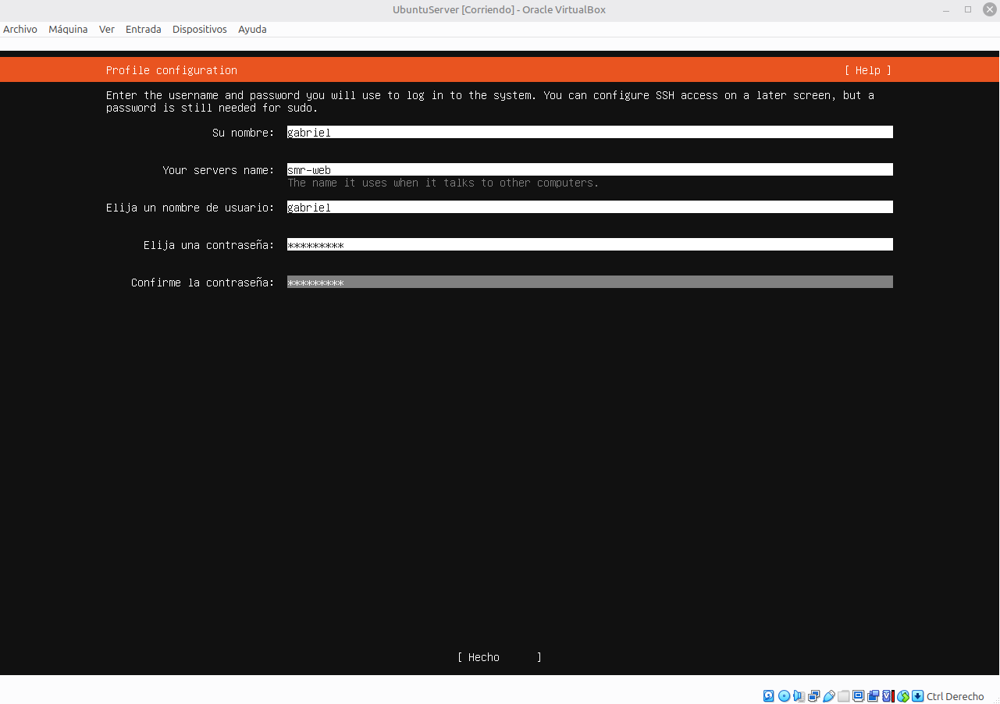
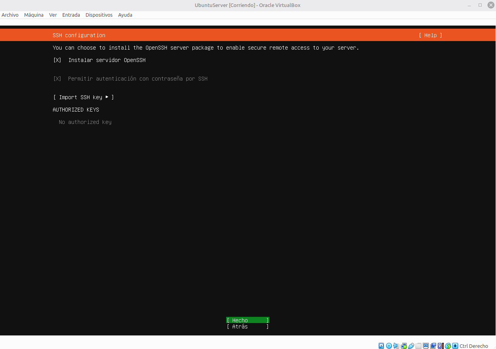
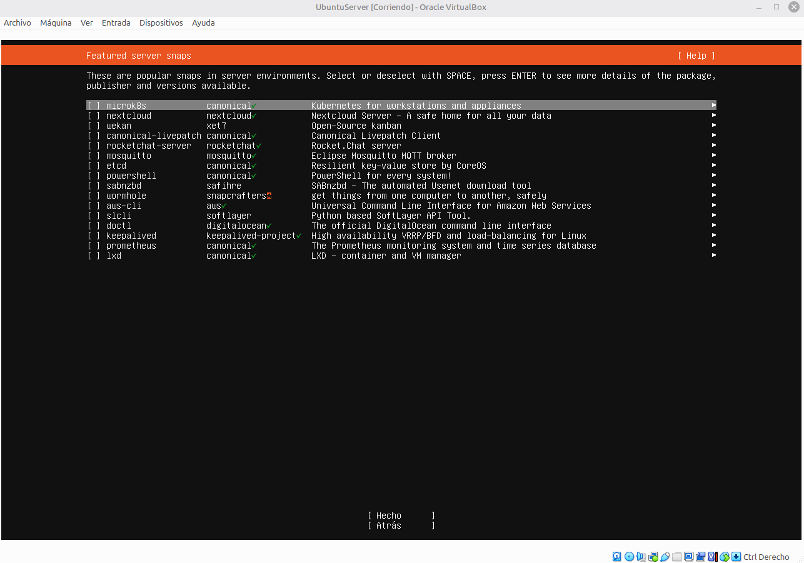

# Instalación Ubuntu Server

## Errores

Este Error se soluciona dandole root a /sbin/vboxconfig (Necesitas comandos de administrador para esto)

## Paso 1 Crear la red Host-only en VirtualBox

### Paso 1 Abre El Gestor De Redes
En virtualbox tienes que ir a archivo arriba a la izquierda y le das a herramientas y luego a red.

### Paso 2 Crea El Adaptador
Le das a crear y aparecera un adaptador nuevo llamado vboxnet0.

### Paso 3 Revisa la configuración IPv4
Comprueba que la direccion de la red es algo como 192.168.56.1/24 si no esta asi le das click-derecho, propiedades y las añades tu mismo.

### Paso 4 Servidor DHCP
Se puede dejar desactivado de momento.

### Paso 5 Cierra el gestor
Deberia de quedar algo asi

## Paso 5 Instalar Ubuntu Server 24.04

### Paso 1 Idioma

### Paso 2 Teclado

### Paso 3 Tipo De Instalación

### Paso 4 Configuración De Red

### Paso 5 Proxy y Mirror

### Paso 6 Almacenamiento
Aqui tenemos que marcar la casilla que pone usar el disco completo.

### Paso 7 Perfil Del Usuario

### Paso 8 Servidor SSH

### Paso 9 Snaps Destacados

### Paso 10 Fin De La Instalación
Ahora lo unico que hay que hacer es esperar a que termine y darle a Reboot Now.
